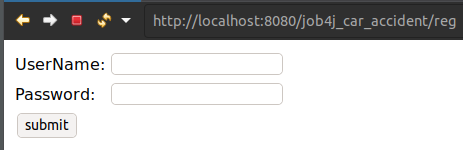
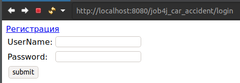
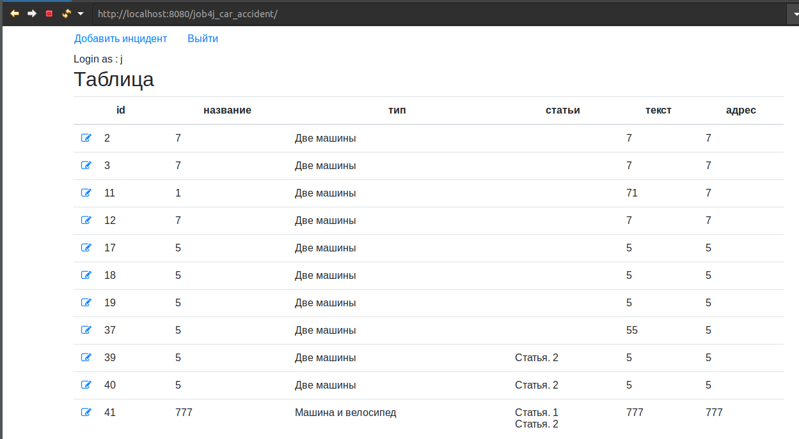
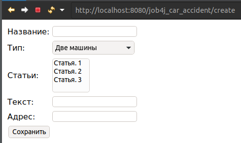
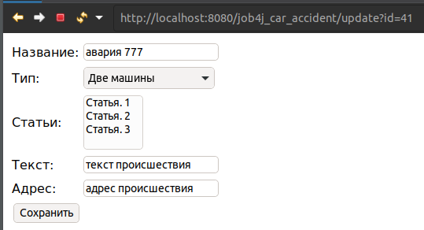
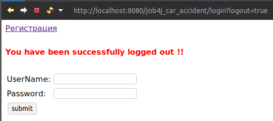

[](https://travis-ci.org/KirillDan/job4j_car_accident)
<br/>
# Проект "Автонарушители"

### О проекте

Приложение имеет CRUD функционал для инцидентов. Для каждого инцидента можно указывать
список статей, описание, тип и др.

Использованные технологии в проекте:

- клиентская часть: HTML, CSS, JS.
- серверная часть: Spring, Spring Security, Spring Data, liquibase

### Сборка

Необходимо создать базу данных auto_crash в СУБД PostgreSQL и указать параметры в файле src/main/resources/application.properties:
```
jdbc.url=jdbc:postgresql://127.0.0.1:5432/auto_crash
jdbc.username=postgres
jdbc.password=123
```

Cобрать maven проект: mvn package

Запуск на сервере Tomcat

### Использование

* Регистрация



* Вход



* Главная страница



* Создание нарушения



* Страница Изменения нарушения



измененные данные


* logout



### Контакты

* Skype: live:.cid.8f17c3f8d147e77


